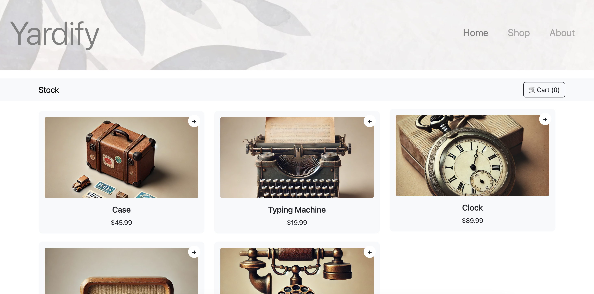

YardSale Online

Description

YardSale Online is a web application designed to help users sell unwanted household items and notify their neighbors about upcoming yard sales. With the increasing trend of online shopping, our platform allows users to list items for sale, giving neighbors the option to purchase online and have the products delivered to their doorsteps.

Motivation

To make yard sales more accessible and convenient for both sellers and buyers.

To help users declutter their homes efficiently while reaching a larger audience.

To provide a seamless and user-friendly experience for buying and selling second-hand items online.

Problem Solved

Traditional yard sales have limited reach and require physical presence.

Online marketplaces are often cluttered with unrelated listings, making it hard to find local deals.

This project streamlines the process by integrating local sales with online purchasing and delivery options.

What I Learned

Implementing an e-commerce-like experience for a local marketplace.

Developing a responsive web application with user authentication and item listing functionalities.

Handling online transactions and delivery logistics.

Table of Contents

Usage

Credits

License

Badges

Features

How to Contribute

Tests

Usage

Sign up or log in to your account.

List items for sale by providing descriptions, images, and prices.

Browse available listings in your area.

Purchase items online and schedule delivery or pickup.

Notify neighbors about upcoming yard sales.

Credits

Krispy Koders Developers

https://github.com/gabipayan
https://github.com/erveygarcia
https://github.com/DoctorLeQuack1
https://github.com/Ubs91

License

This project is licensed under the MIT License - see the LICENSE file for details.

Link

doctorlequack1.github.io/Yardify/ 

Features

User authentication

Item listing with images and descriptions

Online purchasing and secure payment options

Delivery scheduling

Yard sale event notifications

Mobile-friendly design

How to Contribute

We welcome contributions from the community! To contribute:

Fork the repository.

Create a new branch (git checkout -b feature-branch).

Make your changes and commit them (git commit -m 'Add new feature').

Push to the branch (git push origin feature-branch).

Open a Pull Request.

Tests

Run the following command to execute tests:

npm test

Thank you for using YardSale Online! 🚀